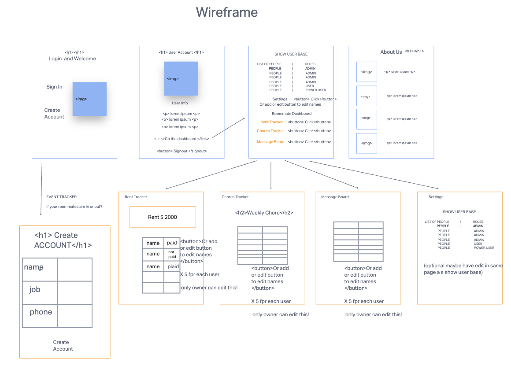
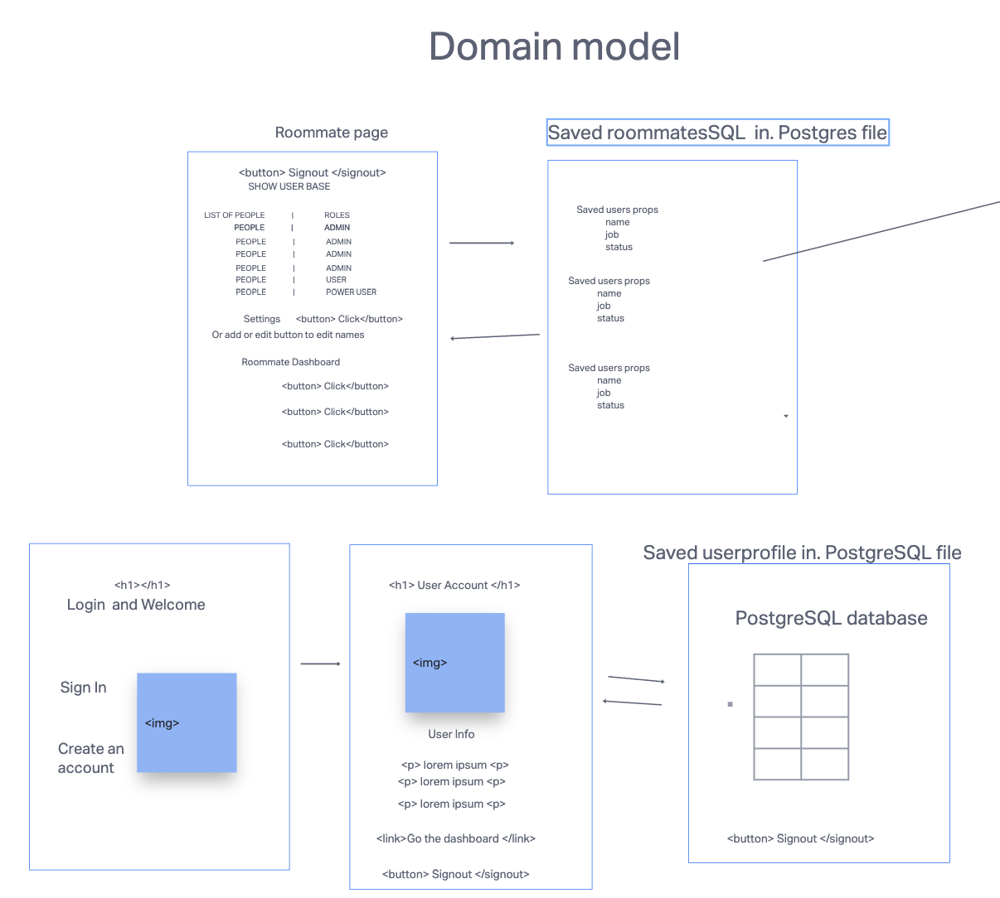
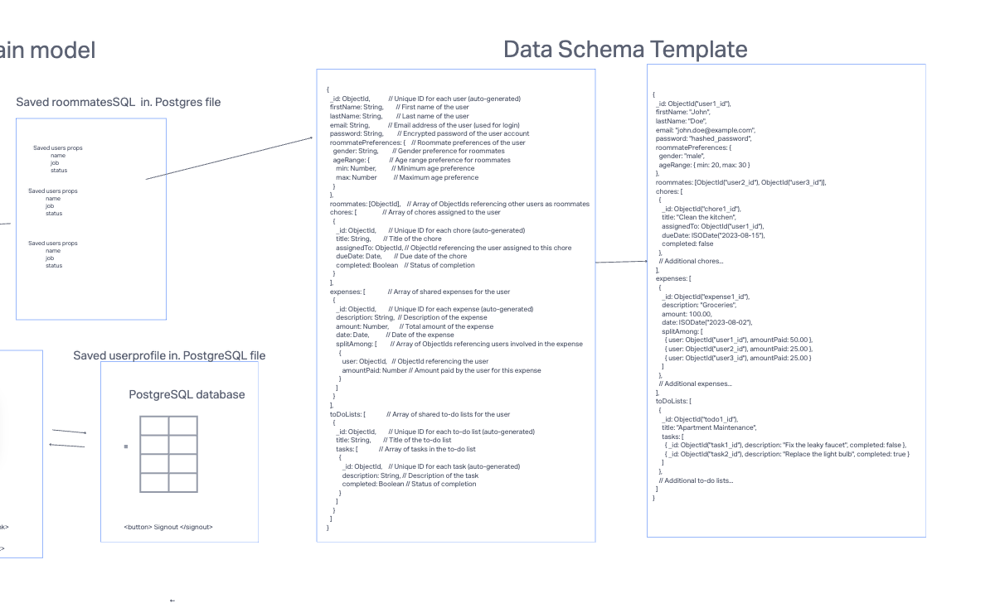

# brewersproject

# Project Title: RoomEase

## Members: Alex Chao, Wasim Soomro, Jon Stillson, Jennifer Sung

## Description
RoomEase is a roommate management system designed to streamline communication and collaboration between roommates, making shared living arrangements more harmonious and organized. It provides a central platform where roommates can easily communicate. By offering a comprehensive solution for roommates, RoomEase aims to reduce conflicts, enhance productivity, and foster a positive living experience.

## Wire Frame

## Revised Wire Frame

## Domain Model

## Data Schema

## Link to User Stories/Trello Board
https://trello.com/b/sZg6p3SY/codebrewersteam
